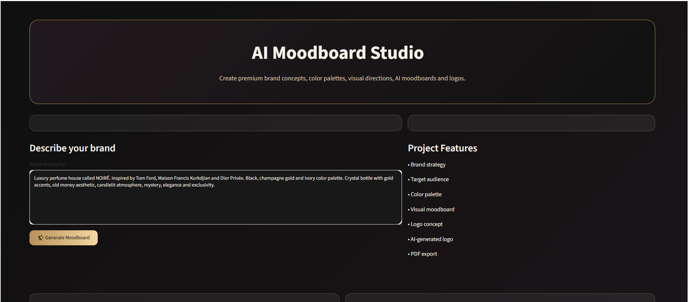
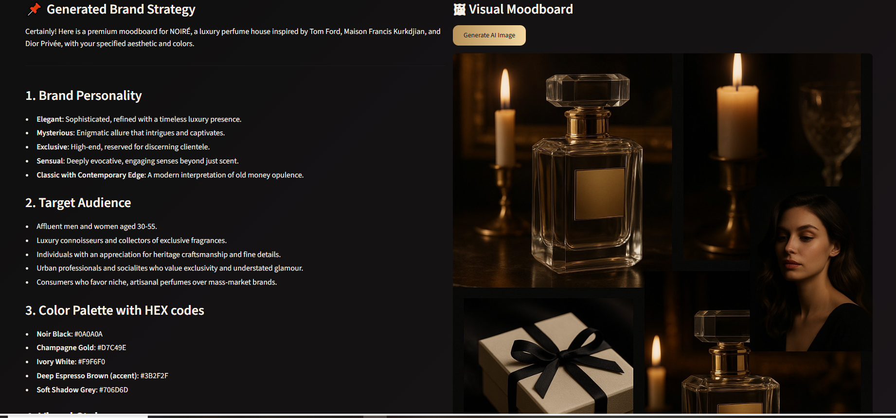
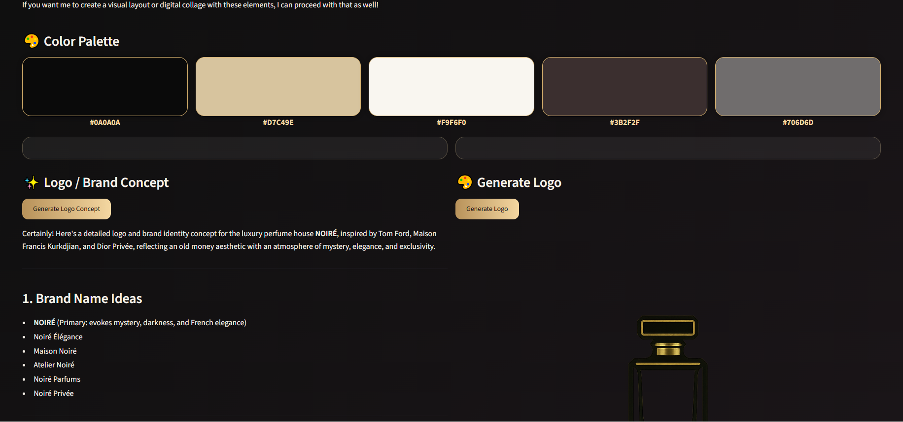
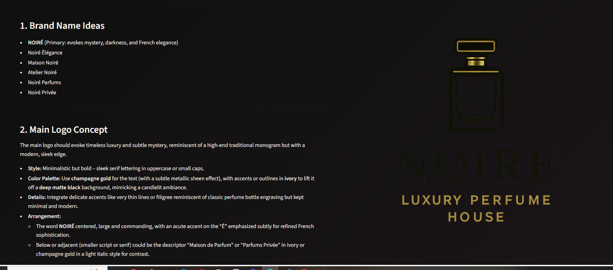

# AI Moodboard Studio

AI-powered branding assistant built with Python, Streamlit and OpenAI API.

The application generates complete brand identity concepts from natural language descriptions, including brand strategy, color palettes, AI-generated moodboards, logo concepts, logos, and downloadable PDF reports.

---

## Features

- Brand Strategy Generation
- Target Audience Analysis
- Color Palette Extraction with HEX Codes
- AI-Generated Visual Moodboards
- AI-Generated Logos
- Logo & Brand Concept Creation
- PDF Report Export
- Interactive Web Interface

---

## Preview

### Home Screen



### Generated Brand Strategy & Moodboard



### Color Palette & Logo Concept



### Generated Logo



---

## Example Workflow

1. Enter a brand description.
2. Generate a complete branding strategy.
3. Generate a visual AI moodboard.
4. Extract and display color palettes.
5. Generate logo concepts.
6. Generate a logo image.
7. Export the entire report as a PDF.

---

## Technologies Used

### Programming Language

- Python

### Libraries & Frameworks

- Streamlit
- OpenAI API
- FPDF2
- Python Dotenv

### AI Models

- GPT-4.1 Mini
- GPT Image Generation

---

## Installation

Clone the repository:

```bash
git clone https://github.com/mtkokovic-cmd/AI-Moodboard-Studio.git
cd AI-Moodboard-Studio
```

Install dependencies:

```bash
pip install -r requirements.txt
```

Create a `.env` file:

```env
OPENAI_API_KEY=your_api_key_here
```

Run the application:

```bash
python -m streamlit run app.py
```

---

## Project Structure

```text
AI-Moodboard-Studio
│
├── images/
│   ├── home-screen.png
│   ├── strategy-moodboard.png
│   ├── color-palette.png
│   └── final-logo.png
│
├── app.py
├── requirements.txt
├── README.md
└── .gitignore
```

---

## Future Improvements

- Brand name generation
- Social media content generation
- Multiple moodboard styles
- Brand guideline export
- Marketing campaign suggestions
- Deployment to Streamlit Cloud

---

## Author

**Matea Koković**

Faculty of Electrical Engineering (ETF), University of Belgrade

GitHub:
https://github.com/mtkokovic-cmd

---

## License

This project is intended for educational and portfolio purposes.